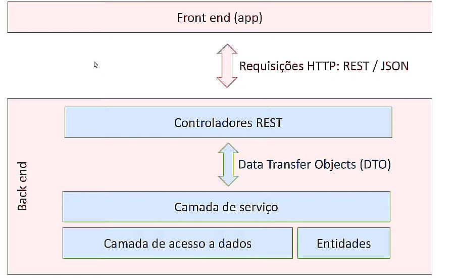

# Padrão Camadas

O padrão do projeto divido em camadas é amplamente utilizado e serve para separar bem as classes em um projeto Spring, ajudando na manutenção posteriormente.

- As classes do pacote de Controladores são responsáveis por receber as requisições do cliente (como solicitações HTTP) e encaminhá-las para outras camadas da aplicação que irão processar os dados necessários. Após o processamento, os Controllers enviam uma resposta de volta ao cliente, geralmente na forma de uma resposta HTTP com um corpo de dados (como JSON) ou uma visualização (como uma página HTML).
- Data Transfer Objects(DTO), são objetos que representam os dados que os Controllers recebem do cliente ou enviam como resposta.
- Camada de Serviços é a responsável por processar os dados que recebe do controlador preparar uma resposta executando alguma lógica e enviar esse dado “mastigado” para o controlador.
- Camada de acesso a dados ou repositório, é responsável por realizar operações no banco de dados, normalmente conversa com a camada de serviços.
- Entidades são objetos que representam o nosso domínio e geralmente correspondem às tabelas do banco de dados.
