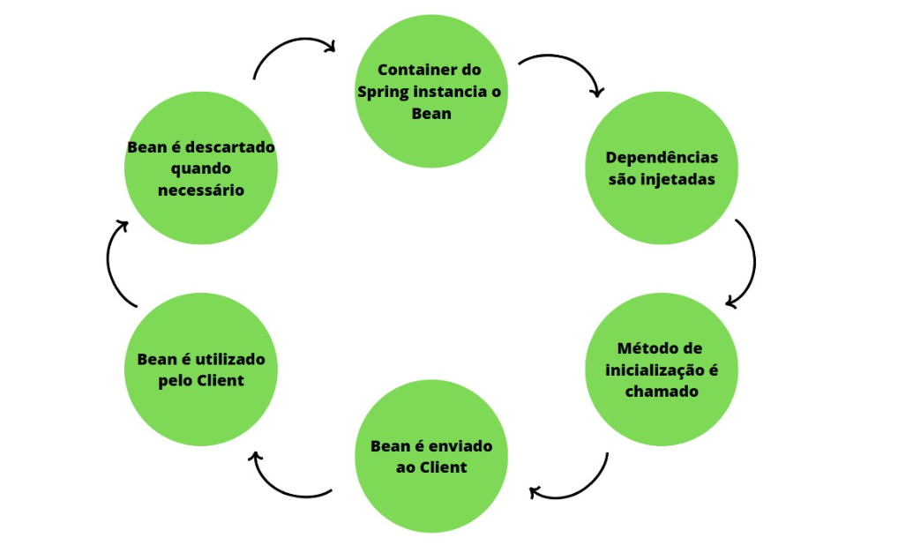

# Bean

• Bean é um objeto que é instanciado, montado e gerenciado pelo container do Spring Framework utilizando IoC e Injeção de Dependência.

• O termo "bean" é usado para se referir a qualquer componente instanciado e gerenciado pelo contêiner do Spring (**@Component**, **@Service**, **@Repository, @Controller, @RestController, @Configuration, @Bean e etc...**)

• Todo bean é um componente instancaido e todo componente instanciado é um bean.

• Assim como tudo na vida, o bean também possui seu ciclo de vida:

• Como podemos ver, o Container cria e inicia o ciclo, logo após a injeção de dependência ocorre, em seguida o método de inicialização é chamado e o Bean é enviado até a classe que possui a dependência, para que ele possa ser utilizado e descartado quando não houver mais utilidade.
