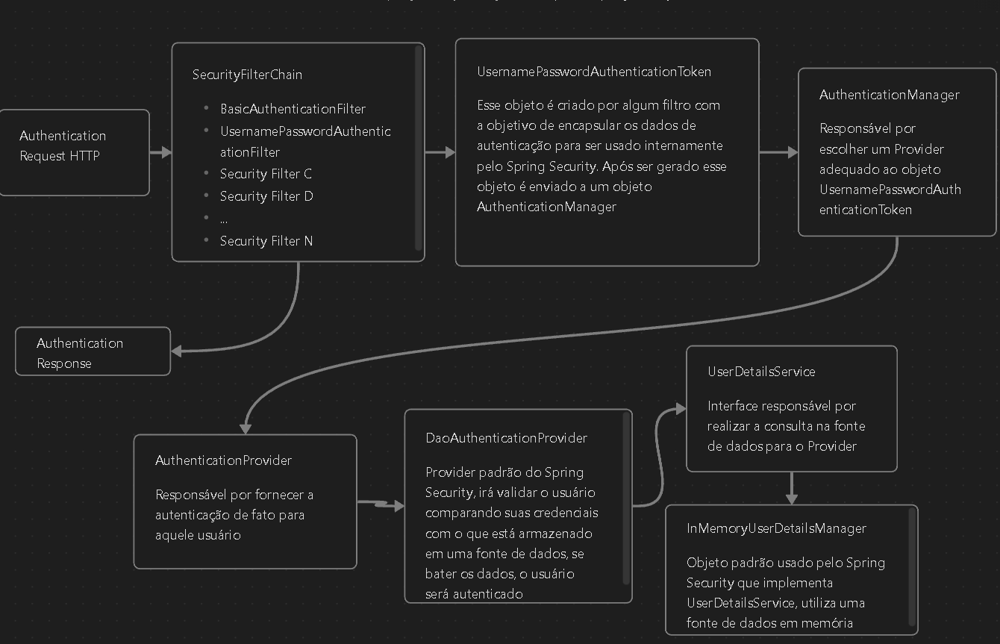

# Fluxo de Autenticação Padrão Spring Security

Esse é um fluxo padrão de autenticação e é uma representação geral do processo e é aplicável a várias versões do Spring Security, no entanto, detalhes específicos e configurações podem variar ligeiramente.

Já sabemos que assim que adicionamos a dependência do Spring Security na nossa aplicação é aplicado automaticamente um mecanismo de autenticação padrão.

E é assim a descrição de como funciona o fluxo dessa autenticação:

1. Inicio

   O fluxo inicia com uma requisição chegando na aplicação com as credenciais do usuario (username e password), temos a principio por padrão duas formas de receber essas credenciais do cliente.

   - **`http.formLogin(Customizer.withDefaults());`** não se incomode de não entender ainda a origem desse método ou não saber onde implementar ele, o importante por agora é entender que ele é um método do Spring Security que adiciona um formulário padrão na API para que o usuário se autentique. Utilizando esse método a aplicação espera receber as credenciais no corpo da requisição HTTP (Forma padrão de envio de credenciais quando se trata de formulários)
   - **`http.httpBasic(Customizer.withDefaults());`** essa é outra forma de receber as credenciais (username e password), é quando elas chegam no cabeçalho "Authorization" da requisição HTTP.
   - Por padrão essas duas formas estarão habilitadas quando adicionarmos a dependência do Spring Security

2. Filtros

   Essa requisição passará por filtros antes de prosseguir para efetuar operações na aplicação, filtro a, b, c.. Cada filtro aplicará um tipo de verificação à requisição para tornar a aplicação mais segura, se a requisição passar por todos os filtros sem falhar em nenhuma checagem ela é considerada segura e a operação para qual ela foi enviada pode ser executada, porém vamos nos atentar apenas aos filtros de autenticação.

   Ao utilizarmos os métodos de autenticação **`httpBasic`** e **`formLogin`** (métodos que já estarão atuando automaticamente ao adicionarmos a dependência do Spring Security) com a customização padrão (**`Customizer.withDefaults()`**), são aplicado dois filtros para capturar as credenciais do usuário de duas formas diferentes e com isso gerar um objeto **`UsernamePasswordAuthenticationToken`**.

   Esse objeto encapsula as informações de autenticação, como nome de usuário e senha, ele é usado internamente pelo Spring Security para representar as credenciais do usuário no processo de autenticação, após gerar esse objeto o filtro envia ele para um objeto do tipo **`AuthenticationManager`** que se encarregará do restante do processo de autenticação.

   - O Filtro usado no httpBasic é o **`BasicAuthenticationFilter`** e ele extrai as credenciais do cabeçalho "Authorization"
   - O Filtro usado no formLogin é o **`UsernamePasswordAuthenticationFilter`** e ele extrai as credenciais do corpo da requisição que enviado junto ao formulário.
   - Podemos personalizar esse processo criando o nosso próprio filtro
   - Também podemos personalizar esse processo recebendo as credenciais como um objeto DTO no Controller depois criamos o objeto **`UsernamePasswordAuthenticationToken`** e em algum serviço enviamos ele para o **`AuthenticationManager`**.

3. **`AuthenticationManager`**

   Ele é responsável por encaminhar o objeto **`UsernamePasswordAuthenticationToken`** para um objeto **`AuthenticationProvider`** adequado, por padrão ele será encaminhado para o **`DaoAuthenticationProvider`**

   - Os objetos **`AuthenticationManager`** e **`AuthenticationProvider`** são criados em algum momento por debaixo dos panos pelo Spring Security. Para personalizarmos esses objetos é necessário ou criarmos um Bean desses objetos e injeta-los ou instanciarmos eles.

4. **`AuthenticationProvider`**

   A função dele é fornecer a autenticação de fato para aquele usuário, em específico o **`DaoAuthenticationProvider`** (Provider padrão do Spring Security) irá validar o usuário com base em alguma fonte de dados.

5. Interface **`UserDetailsService`**

   O objeto que realizará a consulta na fonte de dados e irá fornece-la para o **`DaoAuthenticationProvider`** é um objeto que implemente a interface **`UserDetailsService`** , que por padrão é o **`InMemoryUserDetailsManager`** , responsável por guardar e acessar o usuário em memória.

6. Fim

   Se a autenticação for bem sucedida o **`UsernamePasswordAuthenticationFilter`** ou o **`BasicAuthenticationFilter`** cria um objeto **`Authentication`** representando o usuário autenticado, esse objeto **`Authentication`** é colocado no contexto de segurança atual, para que o Spring Security saiba que o usuário está autenticado

Veremos com mais detalhes como personalizar todo esse processo da forma que quisermos, essa é apenas uma visão inicial do todo para termos uma noção melhor sobre o Spring Security.

É possível personalizar praticamente tudo, o AuthenticationManager, criar vários Providers, criar filtros...
