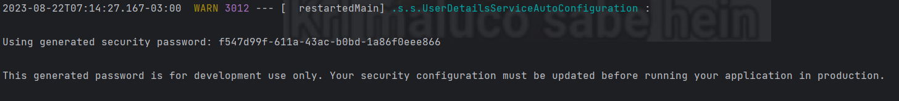
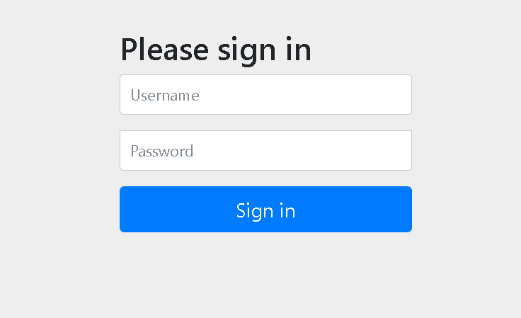

# Autenticação básica padrão, em memória e automática do Spring Security

Ao adicionar a dependência do Spring Security no arquivo **`pom.xml`** e iniciar/reiniciar a aplicação, o Spring Security irá prover uma autenticação básica padrão fornecendo um **usuário padrão** (geralmente "user") e uma senha gerada em memória automaticamente e aleatoriamente (que é impressa no console) sempre que você iniciar a aplicação, caso não tenha definido nenhuma configuração personalizada. Isso ajuda durante o desenvolvimento inicial da aplicação, mas essa senha é uma senha temporária e não deve ser usada em produção.

Exemplo do que aparecerá no console:



Ao acessarmos a API no navegador iremos nos deparar com essa tela de login:




### Spring Security >=5

A partir do Spring Security 5 por debaixo dos panos, quando a aplicação é iniciada, a primeira coisa que o Spring Security verifica é um Bean criado a partir de um objeto do tipo **`SecurityFilterChain`**. Se examinarmos a configuração desse bean, veremos algo semelhante a isso:

```java
@Bean
@Order(2147483642)
SecurityFilterChain defaultSecurityFilterChain(HttpSecurity http) throws Exception {
	http.authorizeHttpRequests((requests) -> {
		((AuthorizeHttpRequestsConfigurer.AuthorizedUrl)requests.anyRequest()).authenticated();
	});
	http.formLogin(Customizer.withDefaults());
	http.httpBasic(Customizer.withDefaults());
	return (SecurityFilterChain)http.build();
}
```

- O parâmetro **`http`** do tipo **`HttpSecurity`**, é utilizado para configurar as regras de segurança.

- **http.authorizeHttpRequests((requests) -> {...});**: Isso começa a configuração de como as solicitações HTTP devem ser autorizadas.

- **((AuthorizeHttpRequestsConfigurer.AuthorizedUrl)requests.anyRequest()).authenticated();**: Isso diz que qualquer requisição (**`anyRequest()`**) que chegar ao servidor deve ser autenticada (ou seja, o usuário precisa estar logado) para ter acesso. Isso inclui todas as URLs da aplicação.

- **http.formLogin(Customizer.withDefaults());**: Isso configura a método de autenticação baseado em formulário. Isso significa que quando um usuário tenta acessar uma URL protegida sem estar autenticado, ele será redirecionado para uma página de login personalizada (que você pode personalizar ainda mais) para inserir suas credenciais.

- **http.httpBasic(Customizer.withDefaults());**: Isso também configura o método de autenticação HTTP básico. O HTTP básico é um método simples de autenticação, no qual as credenciais do usuário (nome de usuário e senha) são transmitidas em texto simples no cabeçalho da solicitação. Geralmente é usado quando a aplicação é uma API que precisa de autenticação.

- **return (SecurityFilterChain)http.build();**: Isso finaliza a configuração e constrói a cadeia de filtros de segurança. Ele retorna um objeto **`SecurityFilterChain`** que foi construído a partir da configuração fornecida no **`http`**.

Já o usuário com a senha é gerada por debaixo dos panos por outro Bean de um objeto chamado **`InMemoryUserDetailsManager`**, se examinarmos a configuração desse Bean veremos algo semelhante a isso:

```java
@Bean
public InMemoryUserDetailsManager inMemoryUserDetailsManager(SecurityProperties properties, ObjectProvider<PasswordEncoder> passwordEncoder) {
	SecurityProperties.User user = properties.getUser();
	List<String> roles = user.getRoles();

	return new InMemoryUserDetailsManager(new UserDetails[]{
		User.withUsername(user.getName())
			.password(this.getOrDeducePassword(user, (PasswordEncoder)passwordEncoder.getIfAvailable())).roles(StringUtils.toStringArray(roles)).build()});
}

private String getOrDeducePassword(SecurityProperties.User user, PasswordEncoder encoder) {
	String password = user.getPassword();
	if (user.isPasswordGenerated()) {
		logger.warn(String.format("%n%nUsing generated security password: %s%n%nThis generated password is for development use only. Your security configuration must be updated before running your application in production.%n", user.getPassword()));
	}

	return encoder == null && !PASSWORD_ALGORITHM_PATTERN.matcher(password).matches() ? "{noop}" + password : password;
}
```
