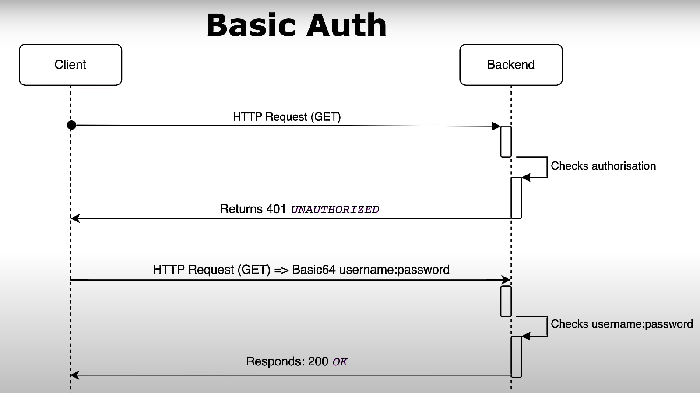

# Explicando autenticação básica

Comunicação do client com a API Backend:

1. **Cliente faz uma requisição HTTP para o Backend**: Isso inicia o processo de comunicação entre o cliente e o backend.

2. **Backend verifica a autorização**: O backend verifica se a requisição do cliente inclui as informações necessárias para autenticação. Isso pode envolver a verificação de um token de autenticação, credenciais no cabeçalho da requisição ou outras formas de autenticação.

3. **Resposta 200 OK ou 401 Unauthorized**: Se o backend reconhecer e validar as informações de autenticação (por exemplo, um token válido), ele responde com um código de status 200 OK, indicando que o cliente está autorizado a acessar o recurso. Se as informações de autenticação forem inválidas ou ausentes, o backend responde com um código de status 401 Unauthorized, indicando que o cliente não está autorizado.

4. **Cliente envia credenciais no formato Basic64**: Se o cliente recebe um código de status 401 Unauthorized, ele precisa enviar as credenciais no formato Basic64 para se autenticar. Isso envolve a codificação do par de usuário e senha em Base64 e enviá-lo como parte do cabeçalho da requisição.

5. **Backend verifica as credenciais**: O backend decodifica as credenciais Basic64, obtendo o par de usuário e senha. Ele verifica essas credenciais em sua lógica de autenticação, que pode envolver a consulta a um banco de dados ou outro mecanismo de armazenamento de credenciais.

6. **Autorização bem-sucedida**: Se as credenciais forem válidas e a lógica de autenticação aprovar, o backend responde com um código de status 200 OK, indicando que o cliente foi autenticado com sucesso.

7. **Autorização mal-sucedida**: Se as credenciais forem inválidas ou a lógica de autenticação não aprovar, o backend responde novamente com um código de status 401 Unauthorized.

É importante lembrar que o método de autenticação básico não é o mais seguro, pois as credenciais são transmitidas em texto simples (ainda que codificadas em Base64). Recomenda-se usar HTTPS em conjunto com outras formas de autenticação, como tokens de autenticação, para aumentar a segurança.

Além disso, é um fluxo básico e pode ser expandido para incluir mais etapas/filtros, como a expiração de tokens, renovação de tokens, gerenciamento de sessões, etc., dependendo das necessidades de segurança e do contexto da sua aplicação.