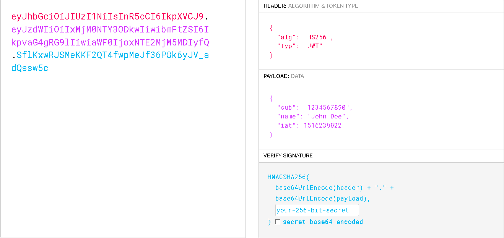

# O que é JWT

JWT é uma forma segura e compacta de enviar informação entre aplicações, é como se fosse um texto grande que tem informações autocontidas dentro desse texto, ele é um token transparente, é possível enxergar informações dentro desse token , exemplo de um JWT(Jason Web Token):

- Header: onde temos informações sobre o tipo do token e o algoritmo de criptografia que foi utilizado

- Payload: onde fica os dados que queremos transmitir dentro do token (informações autocontidas)

- Assinatura: responsável por validar a integridade do token, que foi gerada utilizando um algoritmo de criptografia, é aqui onde colocamos o segredo do nosso token responsável por valida-lo, caso um JWT esteja com um segredo diferente do usado no sistema ele é inválido.

JWT é considerando um token transparente, pois em seu texto fica explicito informações.