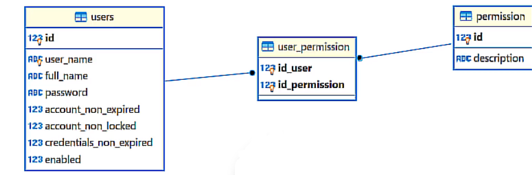

# Autenticar com usuário no banco de dados

Bom para autenticarmos um usuário com ele no banco de dados precisamos entender o seguinte diagrama:

### Entidade User

Na nossa aplicação devemos ter uma entidade que representa os usuários, essa entidade posteriormente deve ser mapeado com JPA à tabela no banco.

Quando criarmos essa entidade existe uma convenção a ser seguida de que ela deve implementar a interface **`UserDetails`**, isso porque o Spring Security utiliza esse tipo para capturar as informações do usuário e realizar a autenticação.

Essa interface possui alguns métodos no seu contrato que retornam informações importantes para o Spring Security, como **`isAccountNonExpired()`**, **`isCredentialsNonExpired()`**...
Então é importante que a entidade tenha atributos que guardem essas informações, pois eles servirão para serem retornados posteriormente, ao implementarmos os métodos da interface **`UserDetails`**.
Basta visualizar a imagem acima lá está os atributos necessários.

### Tabela "users"

A tabela **“users”**, deve conter atributos que guardem informações importantes para a interface **`UserDetails`**, pois eles servirão para serem retornados posteriormente, ao implementarmos os métodos dessa interface na entidade.
Basta visualizar a imagem acima lá está os atributos necessários.

### O que são permissions ?

Quanto as permissions, elas representam a autorização que o usuário possui no sistema, ou seja elas definem quais operações ele está autorizado a realizar na aplicação.
Permissions pode ser por exemplo: **"COMMON_USER"**, **"ADMIN"**, **"MANAGER"**...

### Entidade, VO, atributo de User ouu Enum Permission

Na nossa aplicação devemos ter algo que represente permission, dependendo da nossa estratégia adotada podemos ter um enum, entidade, Value Object ou pode ser um atributo da entidade User, como irei utilizar uma abordagem de salvar a permission no banco de dados então irei criar uma entidade.

**Permission** deve implementar a interface **`GrantedAuthority`**, a implementação dessa interface possui apenas um único método, chamado **`getAuthority()`** que retorna uma **String**, então o único requisito que **Permission** tem é ter é uma **String**, então só precisamos de um dado do tipo **String** para ter uma permission.

Por isso é possivel que ela seja apenas um atributo do tipo **String** de **User** se quisermos, caso seja necessário salvar mais de uma permission podemos utilizar ',' por exemplo: "COMMON_USER,ADMIN,MANAGER".

Voltando a abordagem da entidade, a implementação de **`GrantedAuthority`** é necessária porque o Spring Security utiliza esse tipo para gerenciar a autorização.

### Tabela "permission"

A tabela **“permission”** irá conter apenas uma coluna **"description"** do tipo texto que irá armazenar o tipo daquela permission.

### Tabela user_permission

É possível perceber que existe um método no contrato de **`UserDetails`** chamado **`getAuthorities()`** que ele exige o retorno de uma Collection do tipo **`GrantedAuthority`**, isso acontece porque um usuário pode ter várias permissões/autorizações.

Isso significa que um usuário pode ter várias permissões e, ao mesmo tempo, uma permissão pode estar associada a vários usuários.

Então temos aqui uma relação ManyToMany, representado pela tabela user_permission.

### Outra estratégia para armazenar permissions

Como já falado anteriormente uma outra possível estratégia que podemos utilizar para armazenar as permissions seria criar uma coluna a mais na tabela "users" e um atributo a mais em User chamado permissions do tipo VARCHAR/String por exemplo e nele armazenarmos todas as permissions daquele User, quando formos retornar a Collection de **`GrantedAuthority`**, podemos aplicar uma lógica com utilizando split para pegar o String e retornar um objeto do tipo **`GrantedAuthority`**. com a seguinte instanciação: **`new SimpleGrantedAuthority(txtRole);`**
